<h1 align="center">
   
  🎵 Sonorid
</h1>

  <b>A local music player for Android, with synced lyrics and its own visual identity.</b>

  
  
  
  

---

## 📌 About the Project

**Sonorid** is a local music player for Android, built with **Jetpack Compose**. It scans your library directly from the device (via `MediaStore`), organizes it into Songs, Albums, Artists, and Genres, and lets you build your own playlists and favorites, all stored locally.

Its flagship feature is **synced lyrics**: while a song plays, Sonorid queries **[LRCLIB](https://lrclib.net/)** for a synced (LRC) lyric, and if one exists, displays it line by line following the song's progress, with the ability to tap a line to seek to that point. If the song has no lyrics available, nothing extra is shown — the app keeps working normally.

No account or backend required: your music lives entirely on your phone, and all state (playlists, favorites, lyrics cache, artist info cache) is stored locally with Room.

> ⚠️ **Note:** Sonorid is under active development. The features described below are implemented and tested, but the UI and feature set are still evolving.

---

## ✨ Features

### Library & Playback
- Full library browser from `MediaStore` — Songs, Albums, Artists, and Genres, with built-in search
- Music folder selection: choose which folders on the device get indexed into your library
- Background playback with **Media3 (ExoPlayer + MediaSession)**: shuffle, three repeat modes, audio focus handling, and automatic pause when headphones disconnect
- Persistent mini-player across the whole app + full-screen expanded player
- Dominant color extraction from album art / artist photo (Palette) to theme each detail screen

### Synced Lyrics
- Synced (LRC) lyrics in the expanded player, sourced from **LRCLIB**
- Auto-scroll to the active line, with tap-to-seek on any line
- Local caching with Room: each song is only queried once (including remembering when a lyric *doesn't* exist, to avoid pointless retries)

### Artists
- Artist photo and genre sourced from **TheAudioDB**
- Local caching with Room, with the same "don't retry if already searched and not found" logic
- Auto-generated initials avatar when no photo is available

### Playlists & Favorites
- One-tap favorites, available from any song list
- Create, rename, and manage your own playlists
- Add or remove songs from a bottom sheet, with a 2x2 collage cover generated from each playlist's first songs

---

## 🖼️ Screenshots

  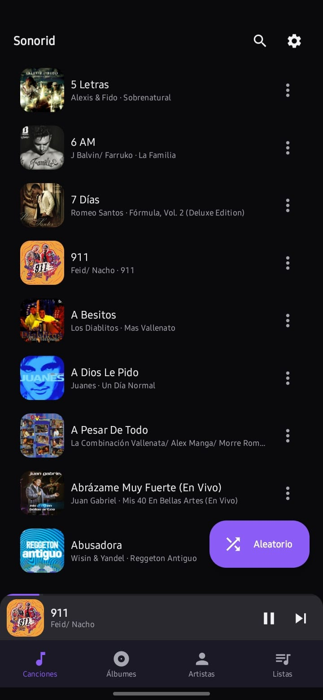 
  <i>Song library</i>

  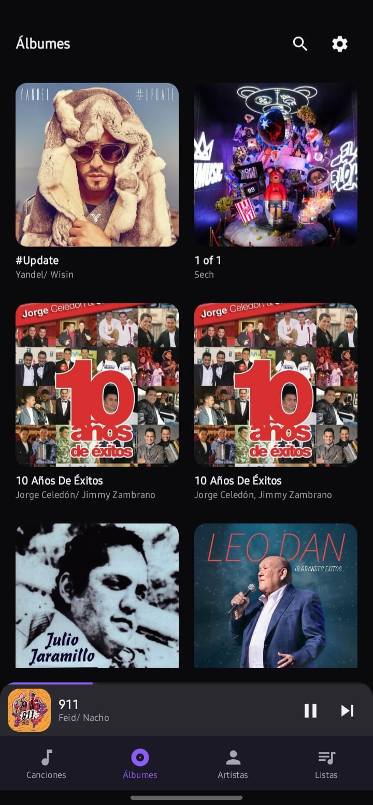
  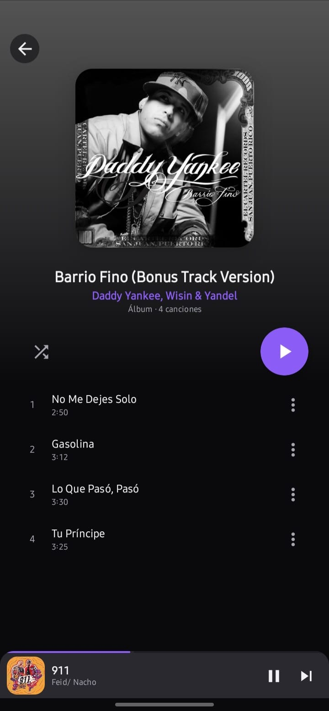 
  <i>Albums and album detail</i>

  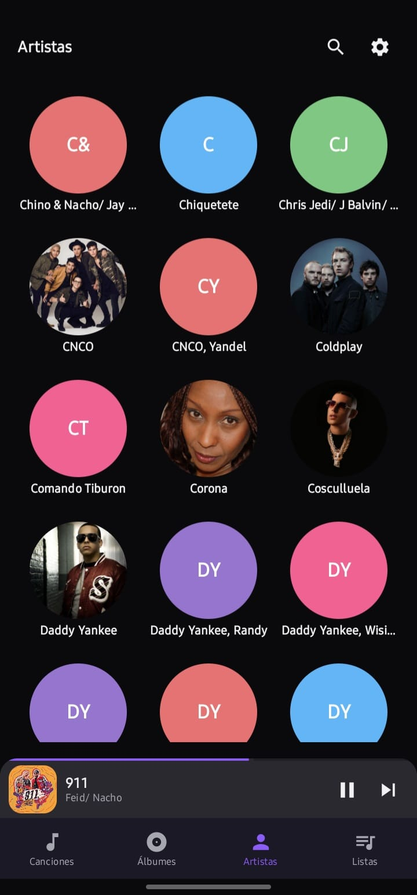
  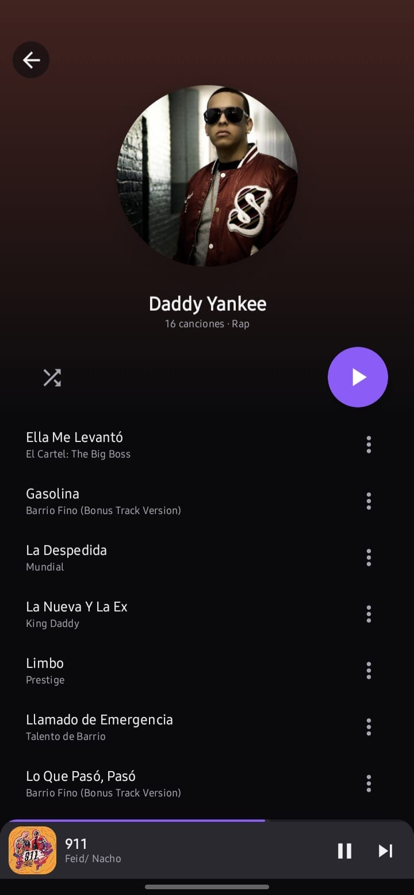 
  <i>Artists and artist detail</i>

  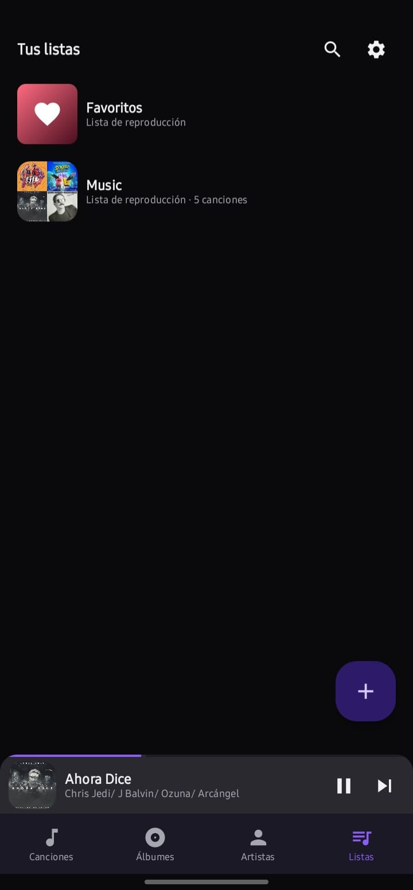
  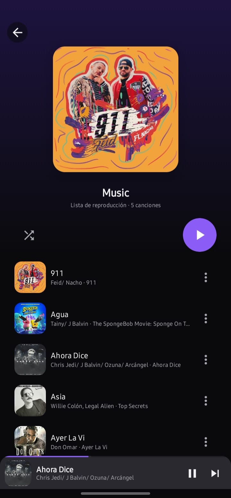 
  <i>Playlists and playlist detail</i>

  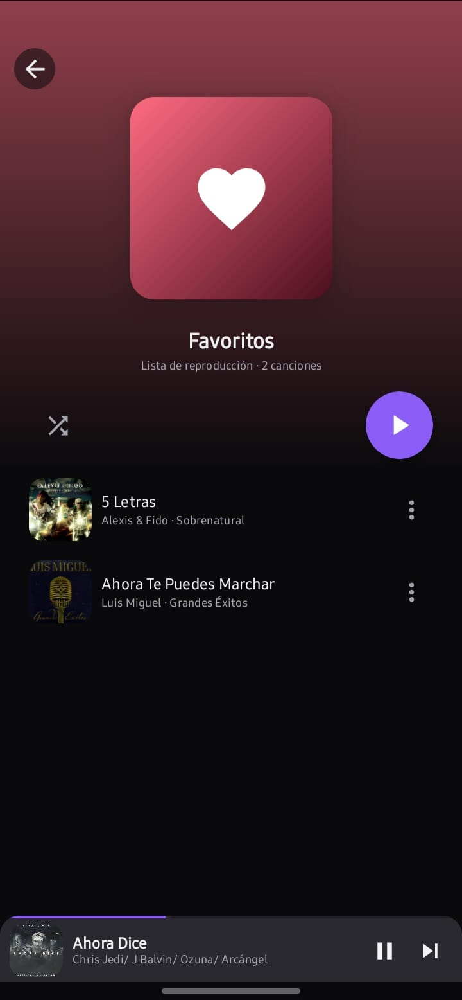 
  <i>Favorites</i>

  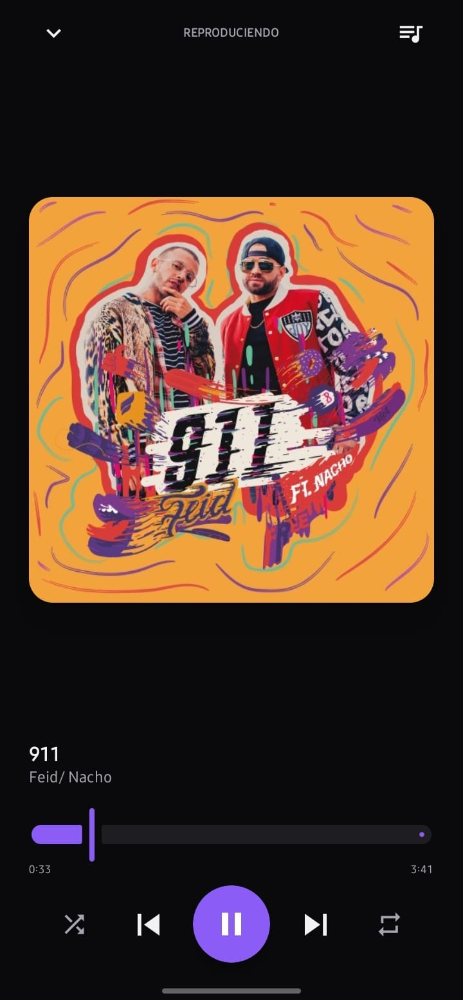
  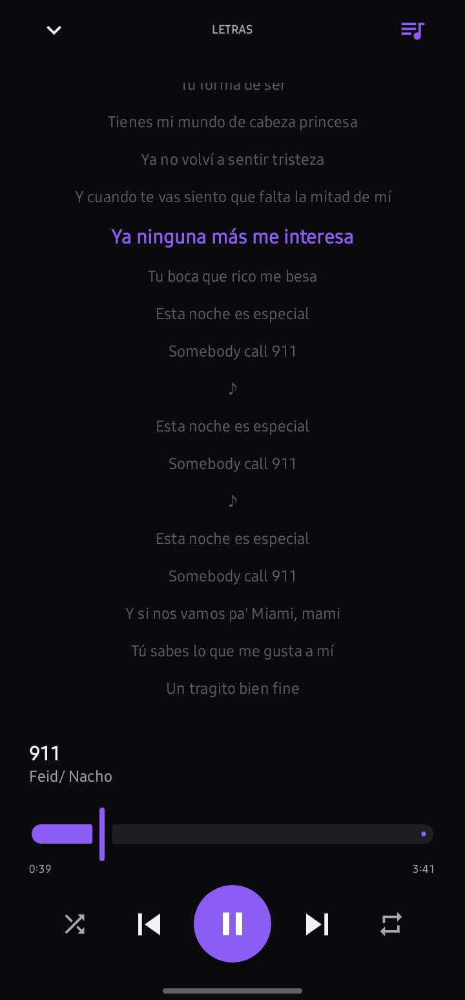 
  <i>Full-screen player and synced lyrics</i>

  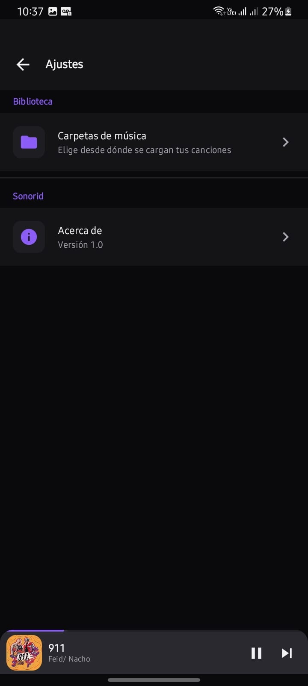 
  <i>Settings / folder selection</i>

---

## 🛠️ Tech Stack

* **UI:** Kotlin + Jetpack Compose (Material 3), custom dark theme ("Sonorid": electric violet, teal, and coral accents), Navigation Compose
* **Architecture:** MVVM — one `ViewModel` + `StateFlow` per screen, dependency injection with **Hilt**
* **Playback:** `Media3` (ExoPlayer + MediaSession), driven by a single shared `MediaController`, with a foreground playback service
* **Local persistence:** `Room` (playlists, favorite songs, lyrics cache, artist info cache) + `DataStore Preferences` (selected folders)
* **Remote data:** `Retrofit` + `kotlinx.serialization` to consume the LRCLIB API (lyrics) and TheAudioDB API (artist info)
* **Images:** `Coil` for album art and artist photos, with `Palette` for dominant color extraction
* **Music source:** Android's `MediaStore` (no backend of its own — everything runs on-device)

---

## 🎤 Credits

- Synced lyrics provided by **[LRCLIB](https://lrclib.net/)**, a free and open lyrics database.
- Artist info and photos provided by **[TheAudioDB](https://www.theaudiodb.com/)**.

Thanks to both projects for making their APIs freely available.

---

## 🚀 Roadmap

- [x] Local library via MediaStore (songs, albums, artists, genres)
- [x] Music folder selection
- [x] Background playback with Media3 + notification
- [x] Synced lyrics via LRCLIB, with local caching
- [x] Artist info via TheAudioDB, with local caching
- [x] Favorites and playlist management
- [ ] Equalizer
- [ ] Android Auto support
- [ ] Home screen widget
- [ ] Playlist export / import
- [ ] Configurable light theme from Settings

---

## 🤝 Contributing

This is a personal project still under active development. If you have ideas, found a bug, or want to suggest an improvement, feel free to open an issue.
